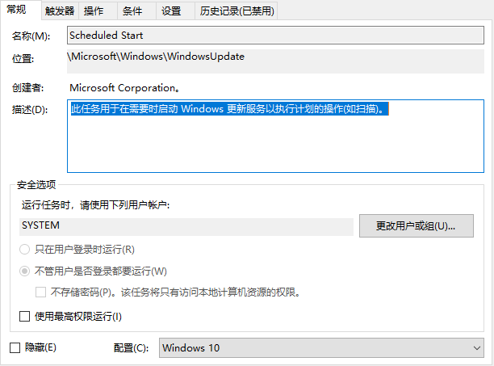

# DisableWin10Updates
Disable Win10Updates

+ Disable Windows 10 update services
    + Windows Update
    + Update Orchestrator Service
    + ...
    + 使用 Win + R 组合快捷键，打开运行对话框，然后输入命令 services.msc。查看与更新相关的内容
    
+ Delete scheduled tasks
    + 使用 Win + R 组合快捷键，输入命令“taskschd.msc”，打开任务计划程序，查看其他需要禁用的计划任务。由于版本不一样，计划任务的路径不一样，如果运行不成功，则需要根据本地的计划任务的路径，修改代码中对应的文字。例如下图中的 计划任务的`位置`:
    

+ Edit services profile
    + 修改start值改成16进制，值改为“4”
    + 修改“FailureActions”键的二进制数据，将“0010”、“0018”行的左起第5个数值由原来的“01”改为“00”
    + 使用 Win + R 组合快捷键，打开运行对话框，然后输入命名 regedit打开注册表,定位到 [HKEY_LOCAL_MACHINE\SYSTEM\CurrentControlSet\Services\]

# 1click.bat

+ 一键激活office 365，必须使用管理员权限执行
